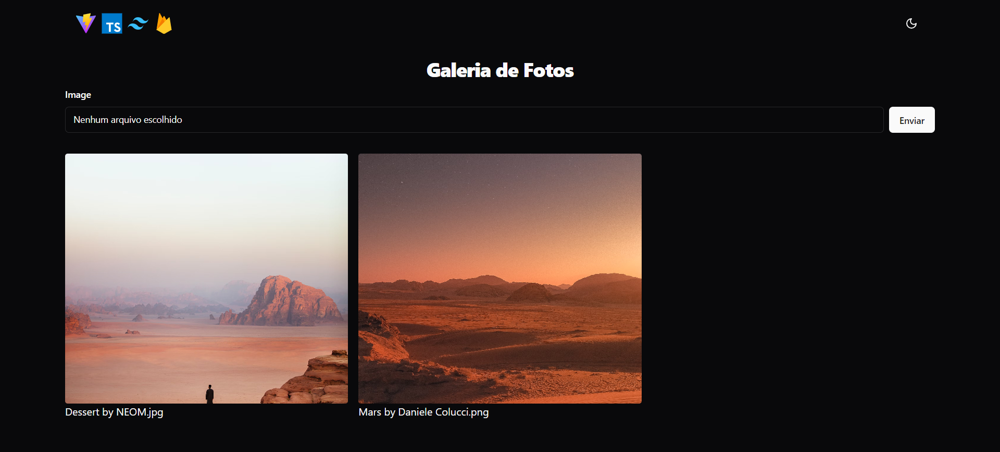

# Galeria

Galeria de Imagens com Firebase. Prática realizada a partir [Galeria de Fotos em React (com Typescript e Firebase) - Projeto 3 - Desafio 5em5 (React)](https://youtu.be/ss4BXa-WfgI) do [Bonieky Lacerda](https://www.youtube.com/@bonieky).

## 🔨 Funcionalidades do projeto

Fazer upload de imagens para a Galeria.

## ✔️ Técnicas e tecnologias utilizadas:

- Vite
- React
- TypeScript
- TailwindCSS
- ShadcnUI
- Firebase

## 📁 Acesso ao projeto

Você pode acessar o [código fonte do projeto](https://github.com/J-Vinicius/gallery-app) ou ver o [deploy na vercel](https://gallery-vite-typescript-firebase-app.vercel.app/).

## 📋 Duplicar projeto

`npm i` e crie um banco de dados no [Firebase](https://firebase.google.com/) e adicione váriaveis local.
